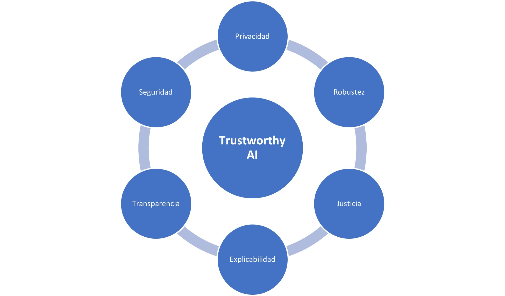

# Aplicación Práctica de Herramientas de Trustworthy AI

Este proyecto tiene como objetivo aplicar las herramientas de Trustworthy AI en un contexto práctico. Se han utilizado diversas herramientas para abordar los pilares fundamentales de Trustworthy AI. A través de este proyecto, se busca comprender y aplicar estas herramientas para desarrollar modelos de IA confiables y éticos.

## Introducción a Trustworthy AI

Trustworthy AI, o IA confiable, se refiere a la creación y el desarrollo de sistemas de inteligencia artificial que sean seguros, justos, explicables y éticos. Estos sistemas deben ser capaces de tomar decisiones informadas y responsables, minimizando los riesgos y garantizando la confianza de los usuarios y las partes interesadas.

Los pilares principales de Trustworthy AI son:

- **Privacidad**: Garantizar la protección de los datos personales y preservar la privacidad de los individuos.
- **Robustez**: Asegurar que los modelos de IA sean resistentes a ataques y errores, manteniendo su rendimiento y confiabilidad en diferentes escenarios.
- **Equidad**: Garantizar que los modelos de IA no introduzcan sesgos o discriminación injusta en sus decisiones.
- **Explicabilidad**: Proporcionar transparencia y explicaciones claras sobre cómo se toman las decisiones y se generan los resultados.
- **Transparencia**: Fomentar la apertura y la divulgación de información sobre el funcionamiento interno de los sistemas de IA.
- **Seguridad**: Proteger los sistemas de IA contra amenazas y ataques externos.

## Contenido del Repositorio

- **Notebooks**: En la carpeta "notebooks" se encuentran los notebooks desarrollados para cada una de las herramientas utilizadas. Estos notebooks contienen ejemplos prácticos y explicaciones detalladas sobre la implementación de cada herramienta.

- **Recursos**: En la carpeta "resources" se encuentra el dataset utilizado en este proyecto, llamado "HeartDiseaseDataset.csv". Este dataset ha sido seleccionado por su idoneidad y marcado para aplicar las herramientas de Trustworthy AI.

## Herramientas Utilizadas

A continuación se presentan las herramientas utilizadas en este proyecto:

- **Privacidad**: [IBM AI Privacy 360](https://github.com/IBM/ai-privacy-toolkit)
- **Robustez**: [IBM Adversarial Robustness 360 Toolkit](https://github.com/Trusted-AI/adversarial-robustness-toolbox)
- **Equidad**: [IBM AI Fairness 360](https://github.com/Trusted-AI/AIF360)
- **Explicabilidad**: [InterpretML](https://github.com/interpretml/interpret/)

## Conjunto de datos

El dataset utilizado en este proyecto se encuentra disponible en [Kaggle](https://www.kaggle.com/datasets/utkarshx27/heart-disease-diagnosis-dataset). El archivo se llama "HeartDiseaseDataset.csv" y contiene los datos necesarios para la aplicación práctica de las herramientas de Trustworthy AI.

## Cómo Utilizar los Notebooks

Los notebooks proporcionados en este repositorio brindan una guía paso a paso sobre cómo utilizar cada herramienta de Trustworthy AI. Puedes seguir los notebooks en el siguiente orden:

1. Notebook de Privacidad: `Privacy_AIPrivacyToolkit.ipynb`
2. Notebook de Robustez: `Robustness_AdversarialRobustnessToolbox.ipynb`
3. Notebook de Equidad: `Fairness_AIFairness360Toolkit.ipynb`
4. Notebook de Explicabilidad: `Explainability_InterpretML.ipynb`

Simplemente abre cada notebook en Jupyter Notebook o JupyterLab y sigue las instrucciones detalladas para aplicar las funcionalidades de cada herramienta en el dataset de "HeartDiseaseDataset.csv".

## Resumen y aprendizajes

En este proyecto de aplicación práctica de herramientas de Trustworthy AI, hemos utilizado diversas herramientas para abordar los pilares fundamentales de Trustworthy AI, como la privacidad, la robustez, la equidad, la explicabilidad, la transparencia y la seguridad. A través de la implementación de estas herramientas en el dataset de "HeartDiseaseDataset.csv", hemos mejorado la confiabilidad, la ética y la transparencia de nuestros modelos de IA.

Estas herramientas nos han permitido proteger la privacidad de los datos, fortalecer la robustez de los modelos frente a ataques adversariales, evaluar y reducir sesgos y discriminación injusta, proporcionar explicaciones claras sobre las decisiones tomadas, fomentar la apertura y divulgación de información y garantizar la seguridad de los modelos frente a amenazas externas.

Este repositorio y los notebooks proporcionados ofrecen una guía práctica para comprender y aplicar Trustworthy AI en proyectos de inteligencia artificial. Esperamos que este trabajo sea útil para futuros proyectos y contribuya a la creación de sistemas de IA confiables y éticos.

¡Gracias por formar parte de este proyecto!